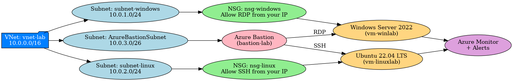

# Azure Virtual Network + VM Lab

## Overview
This lab demonstrates the setup of a secure, production-style Azure environment with:
- A Virtual Network containing multiple subnets
- Windows and Linux Virtual Machines
- Azure Bastion for secure remote access without exposing public IPs
- Network Security Groups (NSGs) controlling inbound and outbound traffic

The goal of this project was to gain practical, hands-on experience in Azure networking, security, and remote access management.

## Architecture
The lab consists of:
- **Resource Group**: project-2-rg
- **Virtual Network**: project-2-vnet
- **Subnets**:
  - AzureBastionSubnet
  - subnet-windows (NSG: nsg-windows)
  - subnet-linux (NSG: nsg-linux)
- **Azure Bastion Host**: bastion-lab
- **Virtual Machines**:
  - Windows Server 2022 — RDP (3389) access
  - Ubuntu 22.04 LTS — SSH (22) access

## Diagrams
**Connectivity Flow**  
.

**Network Architecture**  

## Security Features
- NSGs allowing only Bastion access to VMs
- No public IPs on VMs
- Encrypted TLS (443) browser connection to Bastion
- Segregated subnets for Windows and Linux environments
- Azure Monitor alerts for VM performance

## Skills Demonstrated
- Azure Networking
- Subnetting and Security Groups
- Bastion Configuration
- Remote Access Management
- Secure VM Deployment
- Network Architecture Documentation

## Tools & Services Used
- Microsoft Azure
- Azure Virtual Network
- Azure Bastion
- Network Security Groups
- Windows Server 2022
- Ubuntu Server 22.04 LTS
- Azure Monitor
